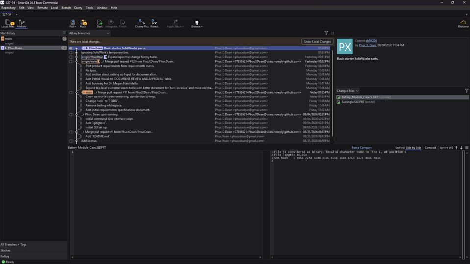

# Using Git.

I recommend using a Git GUI.
The one I use is SmartGit ([download link](https://download.smartgit.dev/smartgit/smartgit-26_1_056-win-installer.zip)).
I've written a tutorial a while back ([guide link](https://github.com/RockSat-X/RSXVT2026/wiki/Onboarding-the-Git-Workflow));
it's slightly out-dated but I suggest referencing it nonetheless.
I do not recommend using GitHub Desktop.

<p align="center"><kbd></kbd></p>&nbsp;

There is a GitHub branch rule applied to `main`.
No one can directly push changes to `main`.
All commits must be merged into `main` through a pull-request.


# Documentation.

Documentation and their media is stored in `./documentation/`.
We use Typst for typesetting.

Open Windows Terminal
and download the `typst` command-line interface:
```
$ winget install typst
```

Restart your shell session
(i.e., close Windows Terminal and reopen)
and check that `typst` is available:
```
$ typst
Welcome to Typst, we are glad to have you here! ❤️
...
```

To convert the `*.typ` documents to PDF,
I recommend using the `typst watch` command;
this will continuously regenerate the PDF every time the `*.typ` document is modified.
```
$ typst watch .\documentation\requirements_specifications.typ
```

The location of the PDF will be in the same folder as the `*.typ` document.
Open the PDF in your browser,
and refresh the browser every time you want to see the newly recompiled document.
Press `CTRL-C` to end the watch command.
